# OA-Demo

# 简介

这是一个用于练习和演示的 OA 示例项目。包含：

- 基本的后台管理功能：包括菜单设置，角色权限设置，菜单设置等。
- 简单的部门和用户管理模块：可以管理部门和用户信息。特别的，支持将用户添加为某部门的虚拟员工，可以用于一个人身兼不同部门职位进行审批。
- 申请和审批：基于 Activiti 实现 BPMN2 定义的审批流的部署、申请单的实现和关联以及提交申请和审批。

再次强调，本项目主要用于练习和演示，所有功能并未经过严谨测试，可能存在潜在 BUG。

# 许可证

本项目基于 Apache 2.0 许可证发行。

# 技术栈

- 前端：Vue+Element-plus
- 后端：Spring Boot
- 数据库：MySQL
- NoSQL：Redis
- 工作流：Activiti 8

# 开发环境

前端代码在[oa-surface](https://github.com/icexmoon/oa-demo/tree/main/oa-surface)，后端代码在[oa-service](https://github.com/icexmoon/oa-demo/tree/main/oa-service)。

前端推荐使用 Cursor/Lingma/VSCode，后端使用 Idea。

项目所需的表结构和数据可以从[这里](https://github.com/icexmoon/oa-demo/blob/main/sql/oa_demo.sql)获取和导入。

前端页面主要通过 AI 辅助生成，和 AI 沟通时使用的内容在[这里](https://github.com/icexmoon/oa-demo/tree/main/documents)。

# 使用手册

## 登录

本系统使用手机号和验证码进行登录，新的手机号将自动添加新用户。并没有真实的短信验证码发送功能，如果用于生产，该功能需要自行实现。为了方便调试，开发环境会通过接口将生成的验证码返回给前端，前端会在控制台输出，可以利用该信息实现自动化测试。测试和生产环境并不会返回验证码。

## 系统管理

### 菜单管理

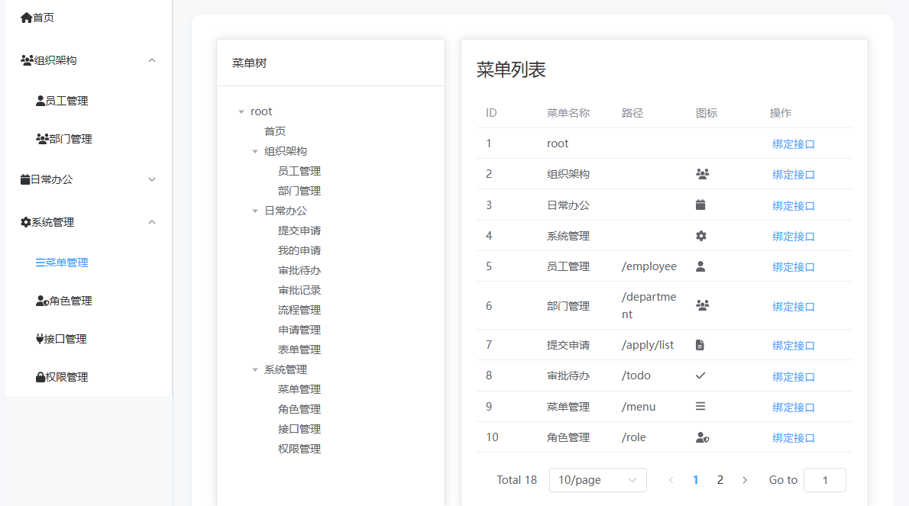

通过操作菜单树，可以增加、编辑或删除菜单。


菜单路径指前端（Vue）中路由的路径，添加的新页面的路径应当是前端路由中已经添加了的可访问的路径。

图标库使用的是[Font Awesome](https://fontawesome.com/start)图标库，前端仅引用了已引用的图标，并没有导入完整图标库，因此使用新的 FrontAwesome 图标，必须在前端中引用。即修改`/plugins/frontawesome.js`文件：

```js
import { 
    faUser, 
    //...
    faRightToBracket,
    faClockRotateLeft,
} from '@fortawesome/free-solid-svg-icons'
library.add(
    faUser, 
    // ...
    faRightToBracket,
    faClockRotateLeft,
)
```

修改排序可以调整同级别菜单显示的先后顺序，值越大越靠前，取值在0~100范围内。

绑定接口功能指将需要暴露给前端的接口绑定到指定页面，让操作指定页面的角色具备访问接口的权限。也就是说，除了部分接口（登录、退出等），所有接口采用白名单管理，如果没有绑定到指定页面，或者用户不具备某页面的相关操作权限，就无法使用具体接口，如果涉及没有权限的接口的调用，服务端会返回 401 错误。

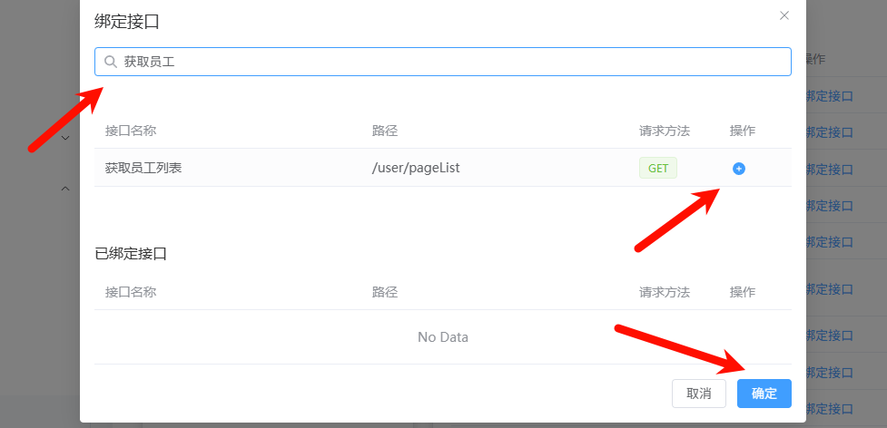

绑定接口按照上图依次操作：搜索->添加到已绑定列表->提交变更。

### 角色管理

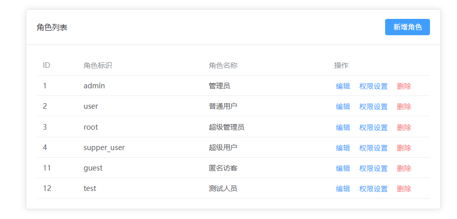

包含对角色的增删改查，因为部分角色在服务端要特殊处理（硬编码），所以建议不要随便删除角色或修改角色标识。

通过角色管理的权限设置可以设置角色有权限访问的菜单页面：

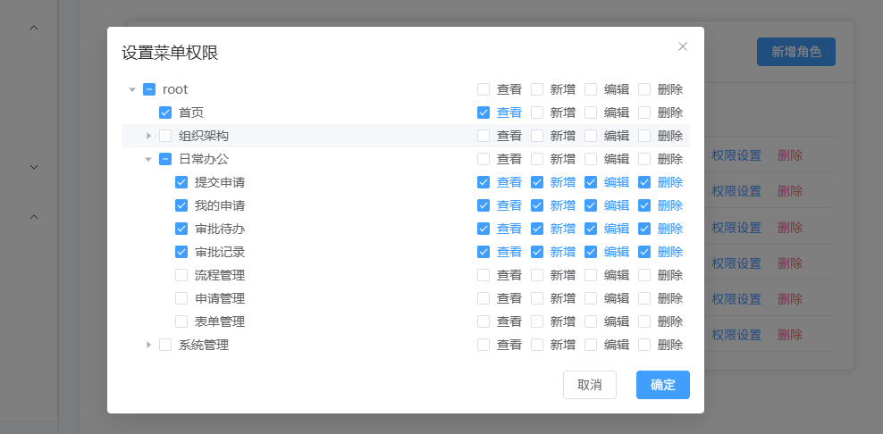

权限具备继承特性，即如果对某菜单的父菜单具备查看权限，则对该父菜单的所有子菜单也具备查看权限。

特别的，即使是超级管理员，能查看到哪些菜单也需要通过这里进行设置，不过仅限于菜单展示，即使看不到任何菜单，超级管理员也有权访问任意接口。

### 接口管理

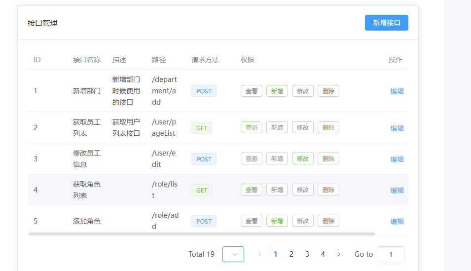

新开发的接口需要在这里添加，并绑定到指定菜单，才能让具备对应菜单操作权限的用户访问。

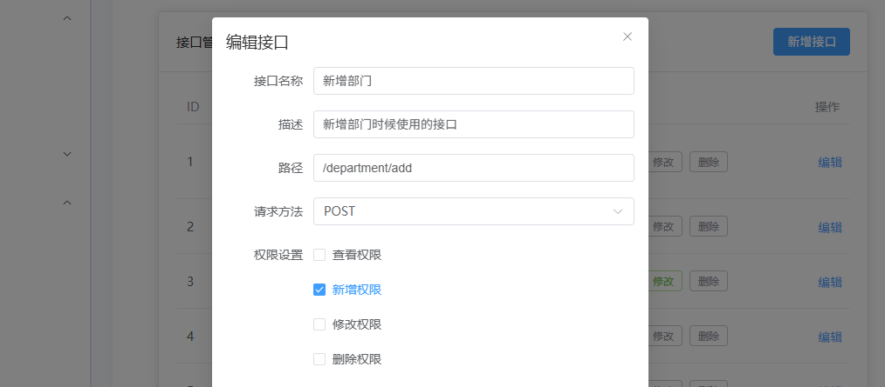

接口按请求方法和路径进行区分，同一个接口可以绑定到多个页面。此外，特别需要注意的是，如果实际接口使用了路径参数，比如：

```
GET /user/info/{userId}
```

这样的接口。在系统中添加时路径一栏需要设置成：

```
/user/info/{id}
```

这是因为系统中的检索逻辑写的比较简单，以硬编码的方式匹配`{id}`的相关路径。

接口权限有增删改查四个维度，对应菜单的四个权限维度，如果某用户有某菜单的查看权限，则仅有该页面绑定的具备查看权限的接口的访问权限。一个接口可以即具备查看权限也具备修改权限。此时需要用户同时具备这两种类型的页面权限才能访问该接口。

### 权限管理

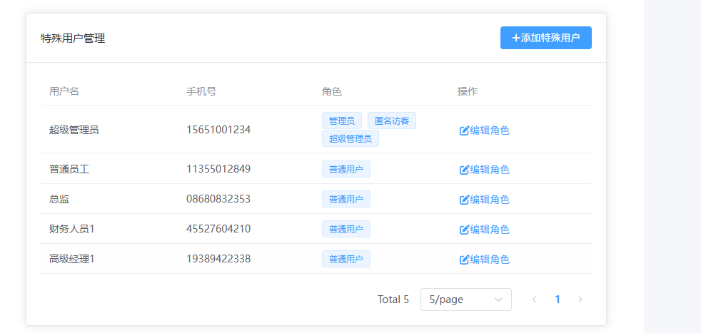

可以给特定用户添加角色，一个用户可以添加多个角色。没有添加角色的用户默认拥有匿名访客这个角色。

> 如果觉得不方便，可以修改代码，让没有角色的用户默认拥有普通员工角色。

## 组织架构

### 员工管理

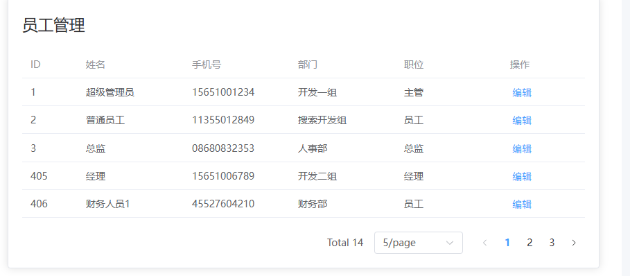

系统默认使用的是新手机号自动生成新用户的方式，所以员工管理页面仅能编辑员工信息。

### 部门管理

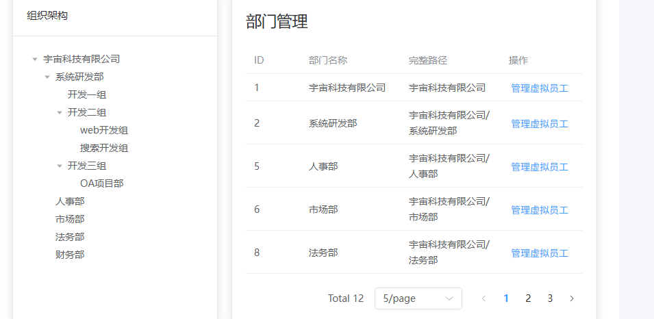

提供对部门的增删改查。

特别的，可以将某个领导添加为某部门的虚拟员工，视作在某部门中兼职某职位，体现在审批流中，系统会先检索具备某职位的真实员工，如果没找到，会检索虚拟员工。

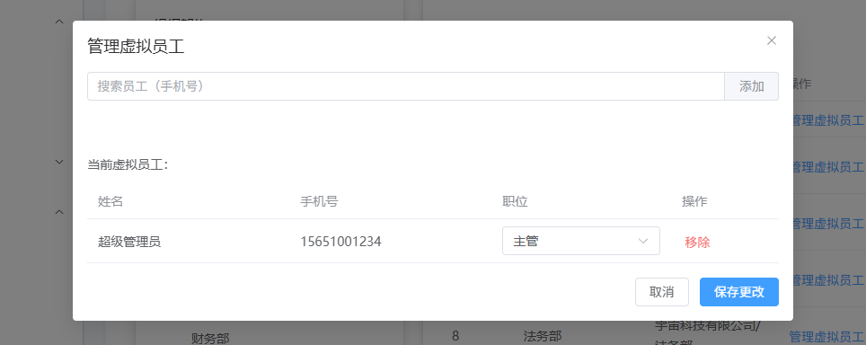

## 日常办公

### 提交申请


显示可以提交的申请，可以提交哪些申请由申请管理页面设置。目前只有**出差申请**这个是可用的示例审批流，可以走完全部审批环节，请假申请仅用于展示申请页面。

### 我的申请

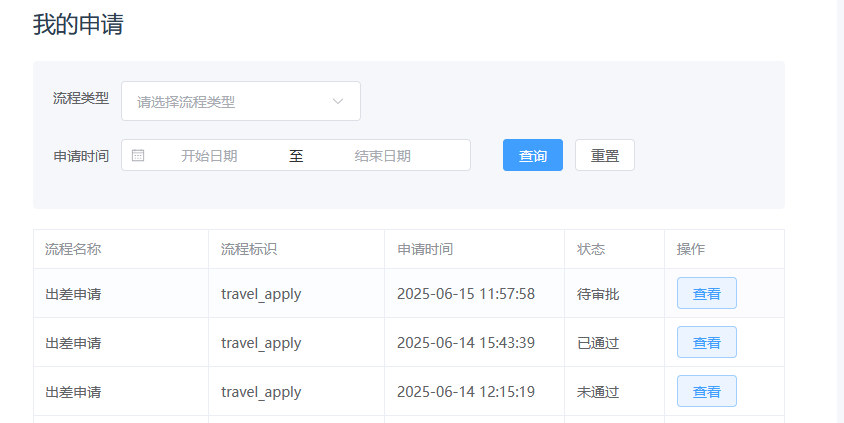

展示提交过的申请。点击查看可以看申请内容和审批到哪一步：

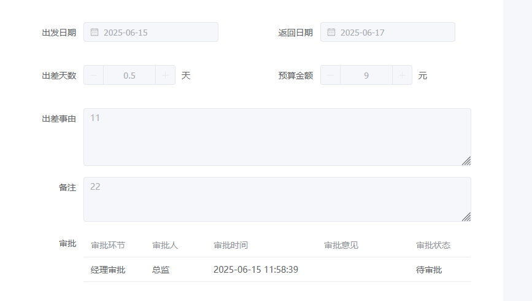

> 这里的审批人总监指的是该用户名字是总监，这只是为了调试方便特别设置的用户名。

### 审批待办

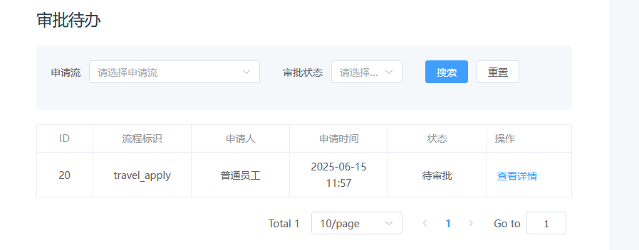

展示需要审批的申请。

点击查看详情后可以进行审批：

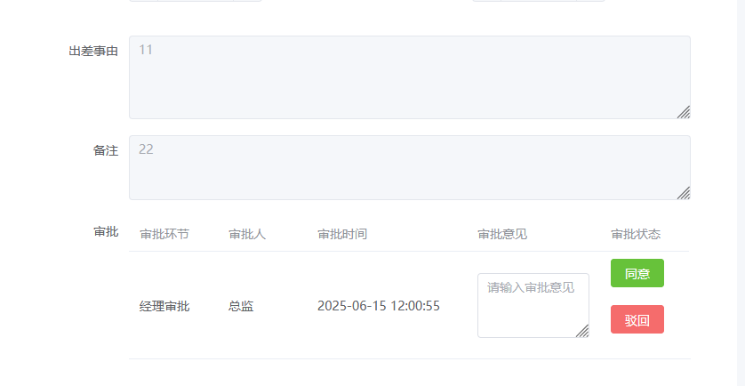

这里的驳回就是不同意，并不是真正的驳回（让审批返回上个审批流节点），如果需要真正的驳回操作，需要自行开发。

### 审批记录

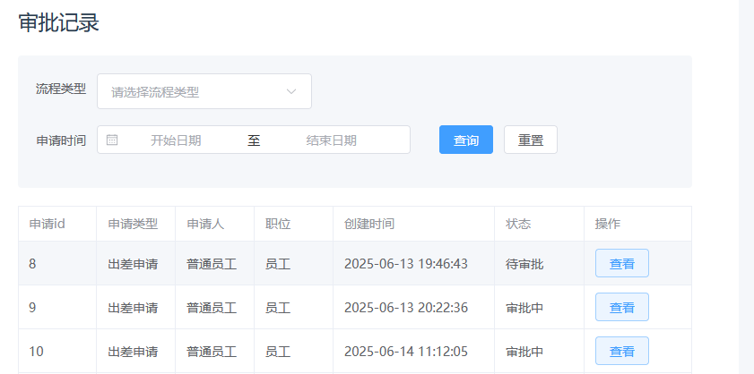

展示已经审批过的申请。

### 流程管理

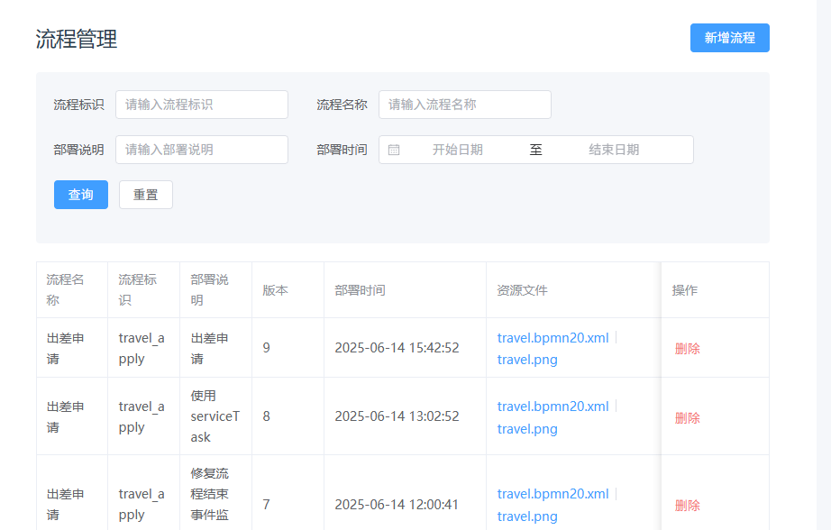

> 这个页面实际对应的是 Activiti 的流程定义部署（Process Definition Deployment）。

在这里可以上传 BPMN2 定义的申请流，用户提交申请时实际触发的是版本号最大的（最后上传的）申请流。

如果要删除申请流，且该申请流有仍在审批中的申请，会在执行删除时显示错误信息，此时可以按提示取消或强制删除，强制删除会将该申请流对应的申请一同删除，但特别的，系统中的业务申请流定义并不会一同删除，所以相关的人依然能看到该申请，只不过该申请无法继续审批。这可以看作是一个 BUG 或特性，取决于产品定义。

### 申请管理

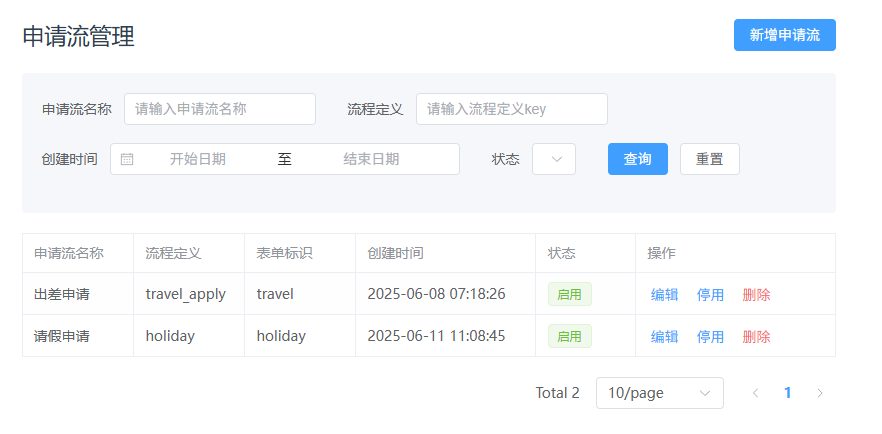

可以管理申请入口。

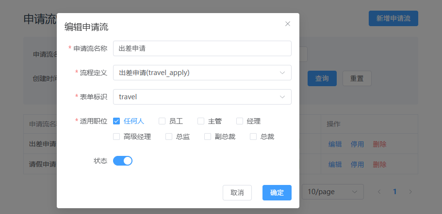

流程定义 key 指流程管理中上传的 BPMN2 文件中的 key，也就是申请提交时触发的 Activiti 工作流的 key。表单标识指申请单提交和查看时使用的前端 Vue 页面的 key，具体由表单管理页面设置。

### 表单管理

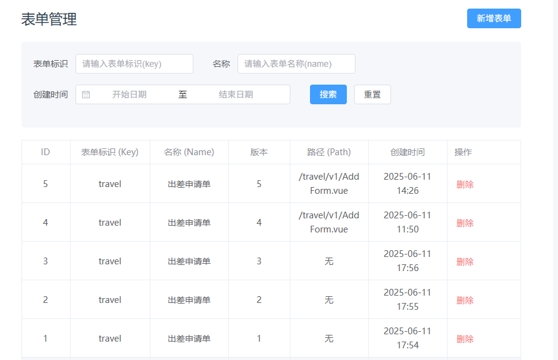

和流程管理类似，申请提交时使用的表单是版本号最大的表单。

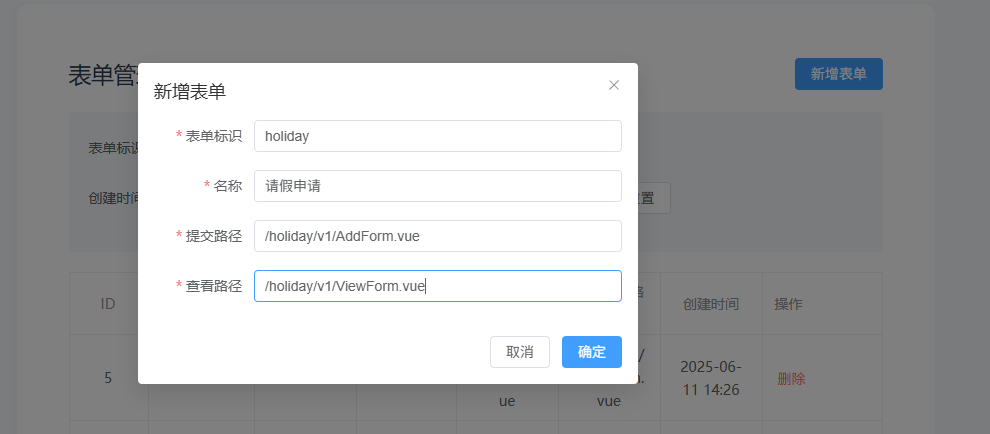

这里的路径指前端项目中的 vue 源码的路径，对应`/components/form/`目录下的路径。

如果要修改已有表单，最好新增 vue 源码而不是直接修改旧的 vue 文件。后者会影响到系统中已有的使用该表单的申请。正确的做法是使用新版本的表单，比如`/holiday/v2/xxx`。

删除时会检查是否有申请已经使用过该表单，如果是，则无法删除。

# End


